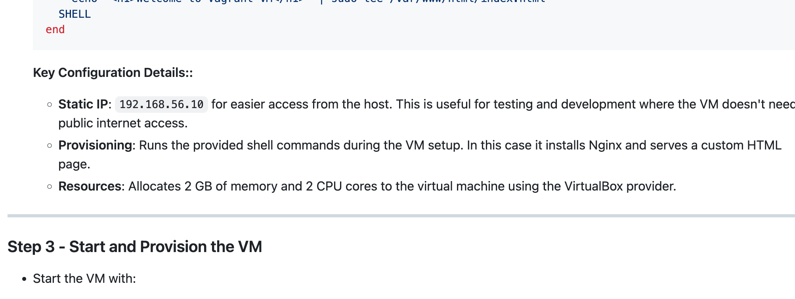
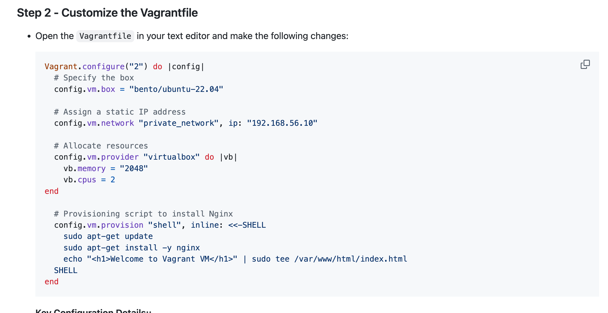

# Setting Up a Virtual Machine with Vagrant and VirtualBox: A Beginner's Guide

## Project Overview:

This project introduces you to setting up a virtual machine (VM) using Vagrant and VirtualBox. By the end, you'll have a fully configured VM running Ubuntu 22.04, serving a basic web page via Nginx. This setup is perfect for development, testing, or learning environments.
 





```
Vagrant.configure("2") do |config|
  # Specify the box
  config.vm.box = "bento/ubuntu-22.04"

  # Assign a static IP address
  config.vm.network "private_network", ip: "192.168.56.10"

  # Allocate resources
  config.vm.provider "virtualbox" do |vb|
    vb.memory = "2048"
    vb.cpus = 2
end

  # Provisioning script to install Nginx
  config.vm.provision "shell", inline: <<-SHELL
    sudo apt-get update
    sudo apt-get install -y nginx
    echo "<h1>Welcome to Vagrant VM</h1>" | sudo tee /var/www/html/index.html
  SHELL
end
```

---

```
sudo systemctl status apache
```
---

https://www.virtualbox.org/ 

[here](https://www.virtualbox.org/ )